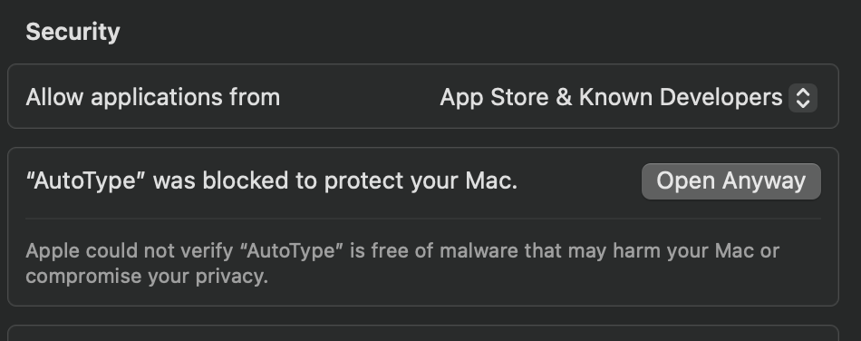

# AutoType

  

A simple macOS utility that helps you type text automatically into any application. Perfect for repetitive typing tasks, code snippets, and frequently used text!

## Features

- 🚀 Automatic text typing with customizable speed
- ⏱️ Adjustable typing delay (0.01 to 0.1 seconds)
- ⌛ 5-second countdown to switch applications
- 📊 Real-time typing progress indicator
- 🔄 Menu bar integration for quick access
- ⌨️ Smart handling of special characters and modifiers
- 📝 Support for multi-line text and code formatting
- 🎯 Precise timing control for reliable typing

## Installation

1. Download `AutoType-1.0.0.dmg` from the [latest release](https://github.com/bunnysayzz/autotype/releases/latest)
2. Open the downloaded DMG file
3. Drag AutoType to your Applications folder
4. Open AutoType from Applications

  

## First Time Setup

When you first open AutoType, you'll need to handle two security prompts:

### 1. Security Warning

If you see "AutoType can't be opened because it is from an unidentified developer":

1. Right-click (or Control-click) on AutoType in Applications
2. Select "Open" from the context menu
3. Click "Open" in the security dialog
4. If needed, go to System Settings > Privacy & Security and click "Open Anyway"

  

After clicking "Open Anyway", you'll see this confirmation:

  

### 2. Accessibility Permission

The app needs accessibility permission to simulate keyboard input:

1. When prompted, click "Open System Settings"
2. Navigate to Privacy & Security > Accessibility
3. Find AutoType in the list
4. Toggle the switch to allow AutoType

  

## How to Use

1. Click the AutoType icon in your menu bar
2. Paste or type your text in the input area
3. Adjust the typing speed using the slider (0.01-0.1 seconds)
4. Click "Start Typing"
5. Switch to your target application within 5 seconds
6. Watch as AutoType types your text automatically!

  

## Tips & Tricks

- Use a slower typing speed (0.05-0.1s) for more reliable typing in slower applications
- For code snippets, AutoType automatically handles indentation
- The 5-second countdown gives you time to switch to your target application
- You can stop typing at any time by quitting the app from the menu bar
- Use Command+V to paste text quickly into the input area

## Requirements

- macOS 10.13 or later
- 64-bit Intel or Apple Silicon Mac
- Accessibility permissions enabled

## Troubleshooting

If you encounter any issues, please check our [Troubleshooting Guide](TROUBLESHOOTING.md) for common solutions.

## Contributing

We welcome contributions! Please see our [Contributing Guidelines](CONTRIBUTING.md) for details.

## License

AutoType is released under the MIT License. See [LICENSE](LICENSE) for details.

## Support

Need help? Have suggestions? [Open an issue](https://github.com/bunnysayzz/autotype/issues) on GitHub.

## Changelog

See [CHANGELOG.md](CHANGELOG.md) for release history and updates. 