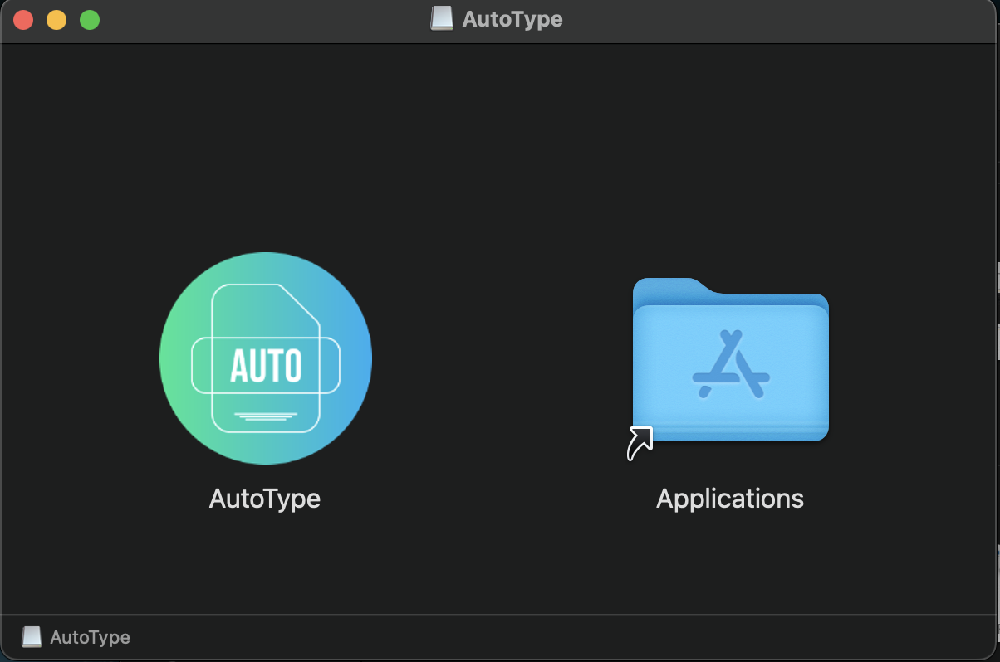
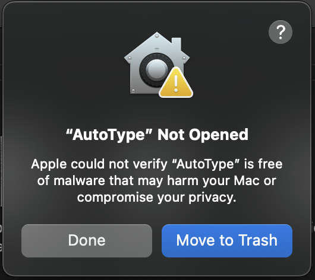
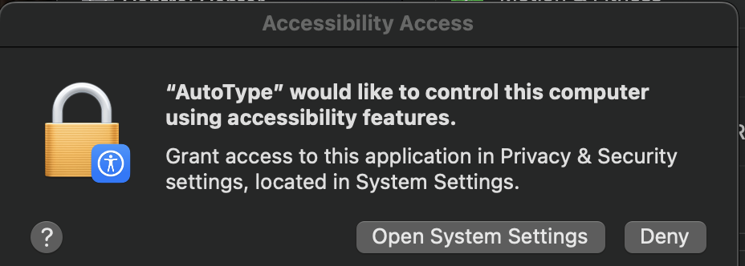
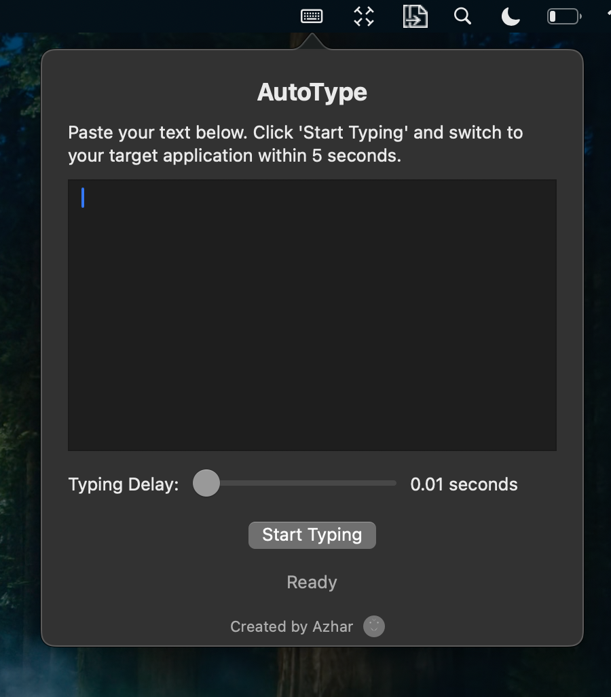

# AutoType

  

A simple macOS utility that helps you type text automatically into any application. Perfect for repetitive typing tasks!

## Features

- 🚀 Automatic text typing with customizable speed
- ⏱️ Adjustable typing delay (0.01 to 0.2 seconds)
- ⌛ 5-second countdown to switch applications
- 📊 Real-time typing progress indicator
- 🔄 Menu bar access for quick use

## Installation

1. Download `AutoType.dmg` from the [latest release](https://github.com/bunnysayzz/autotype/releases/latest)
2. Open the downloaded DMG file
3. Drag AutoType to your Applications folder
4. Open AutoType from Applications

  

## First Time Setup

When you first open AutoType, you'll need to handle two security prompts:

### 1. Security Warning

If you see "AutoType can't be opened because it is from an unidentified developer":

1. Open System Settings
2. Go to Privacy & Security
3. Scroll down to the "Security" section
4. Click "Open Anyway" next to AutoType
5. Click "Open" in the popup

  

### 2. Accessibility Permission

The app needs accessibility permission to type text:

1. When prompted, click "Open System Settings"
2. In Privacy & Security > Accessibility
3. Find AutoType in the list
4. Toggle the switch to allow AutoType

  

## How to Use

1. Click the AutoType icon in your menu bar
2. Paste or type your text
3. Set your preferred typing speed
4. Click "Start Typing"
5. Switch to your target app within 5 seconds

  

## Requirements

- macOS 10.13 or later
- Internet connection for download only

## Support

Need help? [Open an issue](https://github.com/bunnysayzz/autotype/issues) on GitHub. 