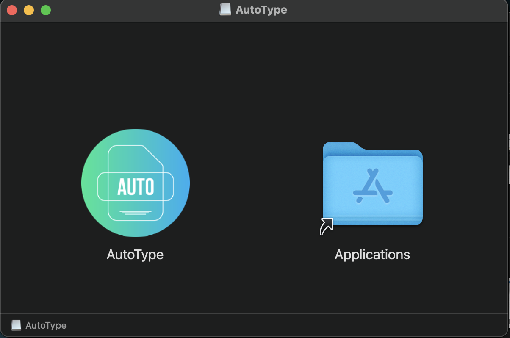
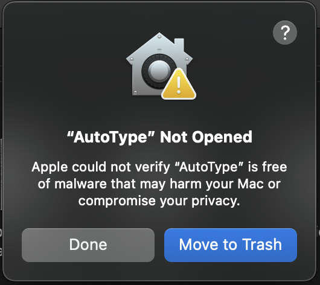
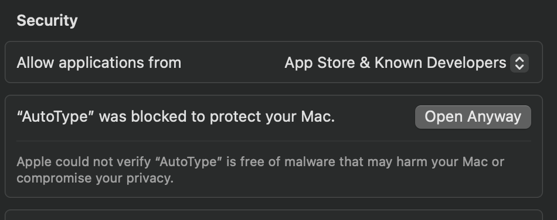
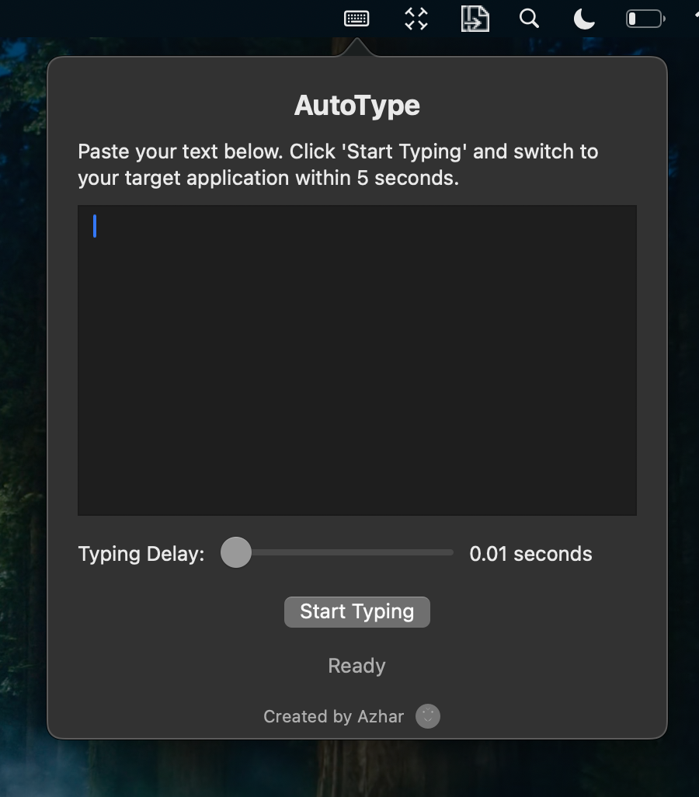

# AutoType

AutoType is a simple macOS utility that allows you to automatically type text into any application after a countdown.

  

## Features

- Paste text and have it automatically typed into any application
- Adjustable typing delay (0.01 to 0.2 seconds between keystrokes)
- 5-second countdown to switch to your target application
- Status indicator showing typing progress
- Menu bar application for easy access

## Requirements

- macOS 10.13 or later
- Xcode 12 or later (for building from source)

## Installation

1. Download `AutoType.dmg` from the [latest release](https://github.com/bunnysayzz/autotype/releases/latest)
2. Open the downloaded DMG file
3. Drag AutoType to your Applications folder
4. Open AutoType from Applications

  

## First Time Setup

When you first open AutoType, macOS will show security prompts. Here's how to handle them:

### Security Warning
If macOS shows "AutoType can't be opened because it is from an unidentified developer":

1. Open System Settings
2. Go to Privacy & Security
3. Scroll down to the "Security" section
4. Click "Open Anyway" next to AutoType
5. Click "Open" in the popup confirmation

  

### Accessibility Permission
AutoType needs accessibility permission to simulate keyboard input:

1. When prompted, click "Open System Settings"
2. In Privacy & Security > Accessibility
3. Find AutoType in the list
4. Toggle the switch to allow AutoType

  

## Usage

1. Click the AutoType icon in your menu bar
2. Paste or type your text in the window
3. Adjust typing speed using the slider
4. Click "Start Typing" and switch to your target application within 5 seconds
5. AutoType will type out your text automatically

  

## Features

- Type text with customizable speed
- Simple menu bar interface
- Easy to use
- Works in any text input field

## Support

For issues and feature requests, please [open an issue](https://github.com/bunnysayzz/autotype/issues) on GitHub. 